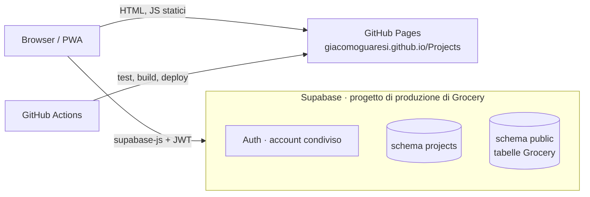

# 03 · Architettura

## Schema generale



## Come funziona

1. **GitHub Pages** serve solo file statici.
2. L'app gira interamente nel browser e usa `@supabase/supabase-js` per:
   - l'accesso con l'account condiviso di Grocery ([05](05-sicurezza.md));
   - la lettura e la scrittura sulle tabelle.
3. Postgres applica i permessi con la **Row Level Security**: senza sessione non si vede nulla.
4. Le regole di business stanno nel database: vincoli, trigger (completo ⇒ 100%), date automatiche, rinomina di un progetto.
5. Nessun backend e nessuna Edge Function nella prima versione. L'assistente IA arriverà con una Edge Function, che custodirà la chiave del provider.

## Convivenza con Grocery sullo stesso progetto Supabase

- **Schema Postgres dedicato `projects`**: nessuna collisione di nomi con le tabelle di Grocery (in `public`), separazione netta, rimozione facile. Va aggiunto agli *Exposed schemas* dell'API. Il client si crea con `db: { schema: 'projects' }`.
- **Autenticazione condivisa**: stesso utente Auth di Grocery.
- **Migrazioni**: la Supabase CLI tiene un solo storico per progetto, e due repository che fanno `db push` sullo stesso progetto vanno in conflitto. Per questo:
  - gli script di Projects stanno in `supabase/sql/NNN_descrizione.sql`, numerati;
  - si applicano a mano, con il SQL Editor o `psql`;
  - lo storico migrazioni della CLI resta a Grocery.
- **Keep-alive**: non serve. Grocery usa il progetto ogni settimana.

## Stack

| Livello | Scelta | Note |
|---|---|---|
| Linguaggio | TypeScript | |
| UI | React 19 | |
| Build | Vite, `base: '/Projects/'` | |
| Routing | hash router: `#/` (Dashboard), `#/attivita` | niente problemi con le rotte profonde su GitHub Pages |
| Stile | **Tailwind CSS**, con la palette definita nel tema | |
| Icone | lucide-react | stesso set di disegni di Grocery (che li copia a mano in `Icona.tsx`): coerenza visiva tra le due app |
| Markdown | react-markdown + remark-gfm + remark-breaks | |
| Dati e accesso | @supabase/supabase-js + @supabase/ssr, come Grocery | sessione nei cookie con percorso `/`, condivisa con Grocery, vedi [05](05-sicurezza.md) |
| PWA | vite-plugin-pwa (solo installabilità, nessun offline dei dati) | |
| Test | Vitest | vedi sotto |
| CI/CD | GitHub Actions | |

## Test

Come in Grocery, i test coprono la **logica pura**, non i componenti:
- parsing dei tag nel titolo;
- iniziali e colore dell'icona del progetto;
- ordinamento e raggruppamento della dashboard;
- filtri della pagina Attività, compreso "Mostra completate";
- suggerimenti dei progetti (deduplica, maiuscole e minuscole);
- decisione se chiedere "solo questa / tutte" al cambio di progetto.

Nessun test end-to-end. Le policy RLS si verificano a mano con la checklist in [05](05-sicurezza.md).

## Struttura cartelle

```
Projects/
├── README.md · Q&A.md · LICENSE
├── doc/
├── index.html · vite.config.ts · tailwind.config.ts · package.json
├── public/                # icone PWA
├── src/
│   ├── main.tsx
│   ├── dominio/           # logica pura + test
│   ├── dati/              # client Supabase, query tipizzate
│   └── ui/                # pagine e componenti
├── scripts/genera-sfondo.ts  # sfondo doodle (npm run sfondo)
├── supabase/sql/          # script SQL numerati
└── .github/workflows/     # pubblica.yml
```

## Ambienti

Un solo ambiente: sviluppo e produzione usano **il progetto Supabase di produzione di Grocery**. `npm run dev` in locale lavora sui dati veri.
