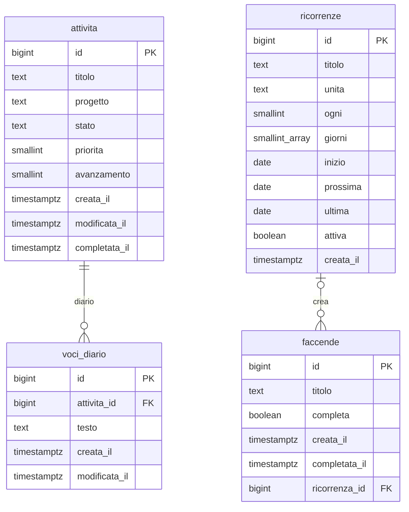

# 04 · Modello dati

Tutte le tabelle stanno nello schema Postgres **`projects`**. Come in Grocery, i nomi sono in italiano.

## Diagramma

## `projects.attivita`

| Campo | Tipo | Vincoli / default | Note |
|---|---|---|---|
| id | bigint | PK, identity | |
| titolo | text | NOT NULL, non vuoto | può contenere tag `<tag>` |
| progetto | text | NULL ammesso | etichetta libera; `trim`, stringa vuota → NULL (trigger) |
| stato | text | NOT NULL, default `'da_fare'`, check in (`da_fare`, `in_corso`, `bloccato`, `completo`) | |
| priorita | smallint | NOT NULL, default `3`, check 1–5 | stelle |
| avanzamento | smallint | NOT NULL, default `0`, check 0–100 | percentuale |
| creata_il | timestamptz | default `now()` | |
| modificata_il | timestamptz | default `now()`, trigger | |
| completata_il | timestamptz | trigger | ordina le completate dalla più recente |

Indici su `stato` e su `lower(progetto)`.

## `projects.voci_diario`

| Campo | Tipo | Vincoli / default | Note |
|---|---|---|---|
| id | bigint | PK, identity | |
| attivita_id | bigint | FK → attivita, `ON DELETE CASCADE`, indice | |
| testo | text | NOT NULL, non vuoto | Markdown |
| creata_il | timestamptz | default `now()` | |
| modificata_il | timestamptz | default `now()`, trigger | "modificata" se diversa da `creata_il` |

Nessun autore: l'account è condiviso.

## `projects.faccende`

Attività veloci e ripetitive, senza attributi ([08](08-interfaccia.md), "Faccende"). Script `supabase/sql/002_faccende.sql`.

| Campo | Tipo | Vincoli / default | Note |
|---|---|---|---|
| id | bigint | PK, identity | |
| titolo | text | NOT NULL, non vuoto | testo semplice, niente tag |
| completa | boolean | NOT NULL, default `false` | |
| creata_il | timestamptz | default `now()` | ordina le da fare |
| completata_il | timestamptz | trigger | `now()` quando diventa completa, `NULL` se riaperta |
| ricorrenza_id | bigint | FK → `ricorrenze`, `on delete set null` | la ricorrenza che l'ha creata; eliminata la ricorrenza, la faccenda resta |

Indice univoco parziale **`faccende_una_aperta_per_ricorrenza`** su `ricorrenza_id` `where not completa`: al massimo una faccenda da fare per ricorrenza.

**Pulizia**: a ogni lettura (apertura dell'app e ritorno in primo piano) l'app elimina le faccende completate prima della mezzanotte locale del dispositivo. Nessun job nel database.

## `projects.ricorrenze`

Le regole delle faccende ricorrenti ([08](08-interfaccia.md), "Faccende ricorrenti"). Script `supabase/sql/003_ricorrenze.sql`.

| Campo | Tipo | Vincoli / default | Note |
|---|---|---|---|
| id | bigint | PK, identity | |
| titolo | text | NOT NULL, non vuoto | il titolo delle faccende create |
| unita | text | `giorno` · `settimana` · `mese` · `anno` | |
| ogni | smallint | 1–365, default 1 | ogni quante unità |
| giorni | smallint[] | solo per `settimana`, lì non vuoto, valori 1–7 | 1 = lunedì … 7 = domenica; `NULL` per le altre unità |
| inizio | date | NOT NULL | prima occorrenza possibile; per mese e anno dà anche il giorno (e il mese) |
| prossima | date | NOT NULL | il giorno in cui creerà la prossima faccenda; la calcola l'app |
| ultima | date | | l'ultimo giorno in cui ha creato una faccenda |
| attiva | boolean | NOT NULL, default `true` | `false` = in pausa |
| creata_il | timestamptz | default `now()` | |

**Occorrenze** (`src/dominio/ricorrenze.ts`): *giorno* ogni N giorni dall'inizio; *settimana* nei giorni scelti, una settimana (da lunedì) ogni N a partire da quella dell'inizio; *mese* e *anno* lo stesso giorno dell'inizio ogni N mesi o anni, o l'ultimo del mese se è più corto (31 → 30 aprile, 29 febbraio → 28).

**Creazione delle faccende**: a ogni lettura delle faccende, dopo la pulizia, per ogni ricorrenza attiva con `prossima` ≤ oggi (data locale del dispositivo) l'app
1. sposta `prossima` alla prima occorrenza dopo oggi e segna `ultima = oggi`, **solo se `prossima` è ancora quella letta** (due dispositivi aperti insieme: vince uno solo);
2. inserisce la faccenda con `ricorrenza_id`; se ce n'è già una da fare l'indice univoco la rifiuta, e va bene così.

Le occorrenze saltate (app non aperta per giorni) non si recuperano: si crea una sola faccenda. Salvare una regola ricalcola `prossima` da oggi, senza ripetere il giorno di `ultima`.

## Viste

- **`projects.attivita_elenco`** (`security_invoker = true`): le colonne di `attivita` più `ha_diario boolean`, usata da tutte le pagine.
- **`projects.progetti`** (`security_invoker = true`): `progetto` e numero di attività, raggruppati senza distinzione tra maiuscole e minuscole. Alimenta suggerimenti, filtro e domanda "solo questa / tutte".

## Funzioni

| Funzione | Cosa fa |
|---|---|
| `projects.rinomina_progetto(vecchio text, nuovo text)` | aggiorna `progetto` su **tutte** le attività (completate comprese) il cui progetto corrisponde a `vecchio`, senza distinzione di maiuscole e minuscole. Una sola istruzione, quindi tutto o niente. `security invoker`, eseguibile solo da `authenticated`. Se `nuovo` coincide con un progetto esistente, i due progetti si uniscono. |

## Regole nel database (trigger)

| Evento | Effetto |
|---|---|
| insert/update di `attivita` con `stato = 'completo'` | `avanzamento = 100`; `completata_il = now()` se prima non era completa |
| update di `attivita` da `completo` a un altro stato | `completata_il = NULL`; l'avanzamento resta modificabile a mano |
| insert/update di `attivita` | `progetto`: spazi rimossi, stringa vuota → NULL |
| update di `attivita` o `voci_diario` | `modificata_il = now()` |

## Permessi

RLS attiva su tutte le tabelle. Policy "solo la sessione autenticata" (`to authenticated using (true) with check (true)`), come in Grocery. Accesso revocato a `anon`, funzioni comprese. Dettagli in [05](05-sicurezza.md).

## Suggerimenti del progetto

Quando si digita il progetto, l'app propone i valori della vista `progetti`. Se il testo corrisponde a un progetto esistente, a meno di maiuscole e minuscole, si usa la grafia già presente: così "casa" e "Casa" non diventano due progetti.
