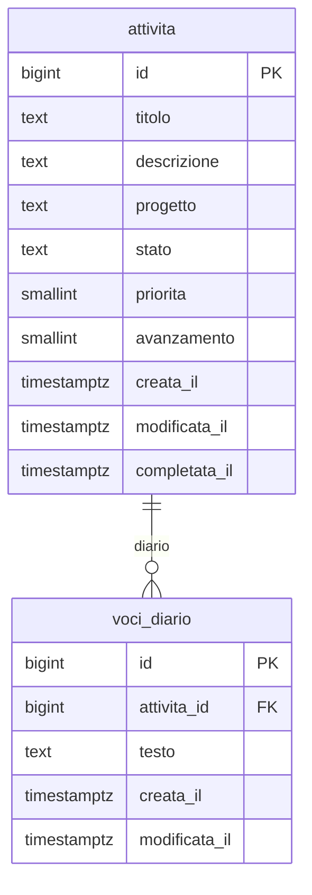

# 04 · Modello dati

Tutte le tabelle stanno nello schema Postgres **`projects`**. Come in Grocery, i nomi sono in italiano.

## Diagramma

## `projects.attivita`

| Campo | Tipo | Vincoli / default | Note |
|---|---|---|---|
| id | bigint | PK, identity | |
| titolo | text | NOT NULL, non vuoto | può contenere tag `<tag>` |
| descrizione | text | | Markdown |
| progetto | text | NULL ammesso | etichetta libera; `trim`, stringa vuota → NULL (trigger) |
| stato | text | NOT NULL, default `'da_fare'`, check in (`da_fare`, `in_corso`, `bloccato`, `completo`) | |
| priorita | smallint | NOT NULL, default `3`, check 1–5 | stelle |
| avanzamento | smallint | NOT NULL, default `0`, check 0–100 | percentuale |
| creata_il | timestamptz | default `now()` | |
| modificata_il | timestamptz | default `now()`, trigger | |
| completata_il | timestamptz | trigger | ordina le completate dalla più recente |

Indici su `stato` e su `lower(progetto)`.

## `projects.voci_diario`

| Campo | Tipo | Vincoli / default | Note |
|---|---|---|---|
| id | bigint | PK, identity | |
| attivita_id | bigint | FK → attivita, `ON DELETE CASCADE`, indice | |
| testo | text | NOT NULL, non vuoto | Markdown |
| creata_il | timestamptz | default `now()` | |
| modificata_il | timestamptz | default `now()`, trigger | "modificata" se diversa da `creata_il` |

Nessun autore: l'account è condiviso.

## Viste

- **`projects.attivita_elenco`** (`security_invoker = true`): le colonne di `attivita` più `ha_diario boolean`, usata da tutte le pagine.
- **`projects.progetti`** (`security_invoker = true`): `progetto` e numero di attività, raggruppati senza distinzione tra maiuscole e minuscole. Alimenta suggerimenti, filtro e domanda "solo questa / tutte".

## Funzioni

| Funzione | Cosa fa |
|---|---|
| `projects.rinomina_progetto(vecchio text, nuovo text)` | aggiorna `progetto` su **tutte** le attività (completate comprese) il cui progetto corrisponde a `vecchio`, senza distinzione di maiuscole e minuscole. Una sola istruzione, quindi tutto o niente. `security invoker`, eseguibile solo da `authenticated`. Se `nuovo` coincide con un progetto esistente, i due progetti si uniscono. |

## Regole nel database (trigger)

| Evento | Effetto |
|---|---|
| insert/update di `attivita` con `stato = 'completo'` | `avanzamento = 100`; `completata_il = now()` se prima non era completa |
| update di `attivita` da `completo` a un altro stato | `completata_il = NULL`; l'avanzamento resta modificabile a mano |
| insert/update di `attivita` | `progetto`: spazi rimossi, stringa vuota → NULL |
| update di `attivita` o `voci_diario` | `modificata_il = now()` |

## Permessi

RLS attiva su entrambe le tabelle. Policy "solo la sessione autenticata" (`to authenticated using (true) with check (true)`), come in Grocery. Accesso revocato a `anon`, funzioni comprese. Dettagli in [05](05-sicurezza.md).

## Suggerimenti del progetto

Quando si digita il progetto, l'app propone i valori della vista `progetti`. Se il testo corrisponde a un progetto esistente, a meno di maiuscole e minuscole, si usa la grafia già presente: così "casa" e "Casa" non diventano due progetti.
